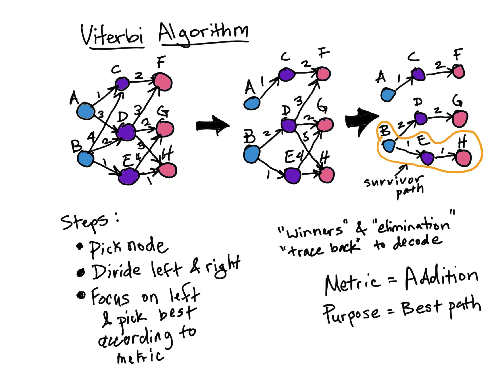

# Named Entity Recognition
## Using Bi-LSTMs, Conditional Random Fields and the Viterbi Algorithm__

Bi-LSTM Diagram
---

Viterbi Algorithm at a Glance
---

Conditional Random Field (CRF) at a Glance
---
